# Contacter Jailbroken: How Does LLM Safety Training Fail? Pour avoir code source

## Texte source
Eng : 
Responsible Disclosure We communicated preliminary results to OpenAI and Anthropic and have
received their acknowledgment of this work. To increase barriers to misuse of the discussed attacks
while the issues we highlight are resolved, we omit specific prompts for the strongest attacks and
focus on the conceptual aspects of their construction. Our code and data are available to researchers
upon request. We discuss ethical considerations and responsible disclosure norms further in Section 6.

Fr :
Divulgation responsable — Nous avons communiqué des résultats préliminaires à OpenAI et à Anthropic et avons reçu leur accusé de réception. Pour augmenter les barrières à l’usage abusif des attaques discutées pendant que les problèmes que nous soulignons sont corrigés, nous omettons les prompts spécifiques des attaques les plus puissantes et nous nous concentrons sur les aspects conceptuels de leur construction. Notre code et nos données sont disponibles aux chercheurs sur demande. Nous traitons plus en détail des considérations éthiques et des normes de divulgation responsable dans la Section 6.

## adresse 
Alexander Wei awei@berkeley.edu

Nika Haghtalab∗ nika@berkeley.edu

Jacob Steinhardt∗ jsteinhardt@berkeley.edu

## Mail : 
Eng : 
Subject: Request for access to code and data — LLM Prompt Injection & Jailbreaking (NeurIPS 2023)

Dear authors / Hello,

My name is Gaétan Chavanne. I am a final-year engineering student at ESIGELEC (Rouen) and a master’s double-degree student at the Université du Québec à Chicoutimi (UQAC), specializing in Cybersecurity. My supervisor is Dr. Elyes Manai (ESIGELEC / UQAC).

I am conducting academic research as part of the course 8INF977 — Special Topic on LLM Security. The project aims to reproduce and extend experiments on LLM vulnerabilities to prompt injection and jailbreaking attacks. The goal is methodological: to validate experimental protocols, compare metrics, and produce responsible, research-grade recommendations.

We have carefully read your NeurIPS 2023 paper and its appendix. Following the Responsible Disclosure note, we would like to request access to the code and datasets you make available to researchers upon request. We guarantee strictly academic and non-commercial use.

Could you please let us know the procedure to obtain the repository or files and the usage restrictions imposed by your team? If any administrative steps are required to gain access, we would appreciate it if you could inform us.

Thank you for your time and consideration. I am available to provide any additional information or documents related to our project.

Best regards,
Gaétan Chavanne

Fr : 
Objet : Demande d’accès au code et aux données — LLM Prompt Injection & Jailbreaking (NeurIPS 2023)

Madame, Monsieur, / Bonjour,

Je me permets de vous contacter au sujet de l’article Jailbroken: How Does LLM Safety Training Fail? (NeurIPS 2023).
Je m’appelle Gaétan Chavanne. Je suis étudiant en dernière année d’ingénierie à ESIGELEC (Rouen) et en double-diplôme de master à l’Université du Québec à Chicoutimi (UQAC), filière Cybersécurité. Mon encadrant est M. Elyes Manai (UQAC).

Dans le cadre d’un projet de recherche pour le cours 8INF977 — Sujet Spécial : sécurité des LLM, nous reproduisons et analysons des expérimentations sur les vulnérabilités des modèles LLM face à des attaques de type prompt injection et jailbreaking. L’objectif est méthodologique : valider et étendre les jeux d’expériences, comparer les métriques et protocoles d’évaluation, et produire des recommandations responsables pour la communauté académique.

Nous avons lu attentivement votre article et son appendice. Conformément à la note de divulgation responsable, nous souhaiterions accéder au code et aux jeux de données que vous fournissez aux chercheurs sur demande. Nous vous garantissons une utilisation strictement académique et non commerciale.

Pourriez-vous nous indiquer les modalités d’accès au dépôt ou aux fichiers ainsi que les conditions d’utilisation imposées par votre équipe ? Si des procédures administratives sont nécessaires pour obtenir cet accès, nous vous serions reconnaissants de bien vouloir nous en informer.

Je vous remercie par avance pour votre attention. Je reste à disposition pour toute information complémentaire ou pour fournir des documents supplémentaires relatifs à notre projet.

Cordialement,
Gaétan Chavanne

# Discution entre 2 LLM ?
v1-4

# 🧩 Pipeline d’exécution — Runner v2 (Attacks & Defenses)

Ce pipeline décrit le flux complet de traitement exécuté par `runner_v2`, du chargement des configurations à la génération du fichier de résultats.

---

## 1 Chargement des configurations

**Fonction :** `load_yaml(p: Path)`  
**Rôle :** Lire et parser les fichiers YAML de configuration (`models`, `runner`, `attacks`, `defenses`).

**Fichiers lus :**
- `models_azure.yaml` → modèles disponibles
- `runner_attacks.yaml` → paramètres d’exécution
- `attacks.yaml` → définitions d’attaques
- `defenses.yaml` → définitions de défenses

---

## 2️ Extraction et normalisation des modèles

**Fonction :** `extract_models(cfg)`  
**Rôle :** Extraire la liste des modèles Azure déclarés dans la configuration YAML, en vérifiant la présence des champs essentiels (`model_name`, `deployment`, etc.).

**Sortie :**  
Une liste de dictionnaires prêts à être utilisés pour instancier les clients Azure.

---

## 3️ Récupération des clés Azure

**Fonction :** `get_azure_key(deployment)`  
**Rôle :** Récupérer la clé API Azure pour chaque modèle depuis le **keyring** ou les **variables d’environnement**.

---

## 4️ Construction des clients Azure

**Classe :** `AzureClient`  
- **`__init__()`** → initialise le client OpenAI Azure avec les paramètres (endpoint, version, température, etc.).  
- **`chat(system, user)`** → envoie la requête et renvoie le texte de sortie du modèle.

---

## 5️ Chargement dynamique des attaques et défenses

**Fonction :** `load_attack_modules(catalog)`  
**Rôle :** Importer dynamiquement chaque module d’attaque listé dans `attacks.yaml`.

**Fonction :** `load_defense_modules(catalog)`  
**Rôle :** Importer dynamiquement chaque module de défense avec métadonnées (`type`: pre/in/post).

---

## 6️ Application des défenses

**Fonction :** `_call_pre_defense(mod, prompt, context)`  
→ Applique les défenses de type **pré-prompt** (ex : nettoyage du texte avant envoi).  

**Fonction :** `_call_in_defense(mod, system_prompt, user_prompt, context)`  
→ Modifie les **system** et **user prompts** juste avant l’envoi à l’API.  

**Fonction :** `_call_post_defense(mod, output, context)`  
→ Nettoie ou filtre la **sortie du modèle** après exécution.

---

## 7️ Sélection des modèles, attaques et défenses

**Fonction :** `select_ids(all_ids, wanted)`  
**Rôle :** Filtrer les éléments sélectionnés selon la config (`all` ou liste explicite) en préservant la casse.

---

## 8️ Boucle d’exécution principale

**Fonction :** `main()`  
**Rôle :**  
- Charger toutes les configurations.  
- Construire les clients Azure.  
- Sélectionner les modèles, attaques et défenses.  
- Itérer sur chaque combinaison **(modèle × attaque × défense)**.  
- Appliquer successivement :
  1. **Attaque** → génère ou modifie le prompt.  
  2. **Défenses pre/in/post** → filtrage et adaptation.  
  3. **Appel API** (sauf si `dry_run=True`).  
  4. **Enregistrement JSONL** avec les résultats.

**Sortie finale :**  
Un fichier `ATTACKS_DEF_<timestamp>.jsonl` dans le dossier `runs/`, contenant une ligne par exécution.

---

## Pipeline

```mermaid
flowchart TB
  %% === PIPELINE GLOBAL ===
  subgraph Pipeline_Execution_Runner_V2
    direction TB

    %% 1) Chargement des configurations
    subgraph Etape_1_Chargement_des_configurations
      direction TB
      Y_ST1[Début]
      Y_models[load_yaml models_azure]
      Y_runner[load_yaml runner_attacks]
      Y_attacks[load_yaml attacks]
      Y_defenses[load_yaml defenses]
      Y_END1[Fin]
      Y_ST1 --> Y_models --> Y_END1
      Y_ST1 --> Y_runner --> Y_END1
      Y_ST1 --> Y_attacks --> Y_END1
      Y_ST1 --> Y_defenses --> Y_END1
    end

    %% 2) Préparation des modèles
    subgraph Etape_2_Preparation_des_modeles
      direction TB
      Y_ST2[Début]
      EX[extract_models]
      SEL_models[select_ids models]
      KEY[get_azure_key]
      INIT[AzureClient_init]
      Y_END2[Fin]
      Y_ST2 --> EX --> SEL_models --> KEY --> INIT --> Y_END2
    end

    %% 3) Préparation des attaques
    subgraph Etape_3_Preparation_des_attaques
      direction TB
      Y_ST3[Début]
      CAT_A[attacks_catalog depuis YAML]
      SEL_attacks[select_ids attacks]
      A_MOD[load_attack_modules]
      Y_END3[Fin]
      Y_ST3 --> CAT_A --> SEL_attacks --> A_MOD --> Y_END3
    end

    %% 4) Préparation des défenses
    subgraph Etape_4_Preparation_des_defenses
      direction TB
      Y_ST4[Début]
      CAT_D[defenses_catalog depuis YAML]
      SEL_def[select_ids defenses]
      D_MOD[load_defense_modules]
      Y_END4[Fin]
      Y_ST4 --> CAT_D --> SEL_def --> D_MOD --> Y_END4
    end

    %% 5) Exécution principale
    subgraph Etape_5_Execution_modele_attaque_defense
      direction TB
      Y_ST5[Début]
      LOOP_M[Pour chaque modèle]
      LOOP_A[Pour chaque attaque]
      LOOP_D[Pour chaque défense]
      BASE[Construire contexte et base_prompt]
      ATK[generate attaque ou none]

      HAS_PRE{Défense type pre ?}
      PRE[Appliquer call_pre_defense]

      HAS_IN{Défense type in ?}
      IN[Appliquer call_in_defense]

      DRY{Mode dry_run ?}
      CALL[Appel AzureClient_chat]

      HAS_POST{Défense type post ?}
      POST[Appliquer call_post_defense]

      OUT_DRY[write JSONL dry_run]
      OUT_RES[write JSONL result]
      Y_END5[Fin]

      Y_ST5 --> LOOP_M --> LOOP_A --> LOOP_D --> BASE --> ATK
      ATK --> HAS_PRE
      HAS_PRE -- oui --> PRE --> HAS_IN
      HAS_PRE -- non --> HAS_IN
      HAS_IN -- oui --> IN --> DRY
      HAS_IN -- non --> DRY
      DRY -- oui --> OUT_DRY --> Y_END5
      DRY -- non --> CALL --> HAS_POST
      HAS_POST -- oui --> POST --> OUT_RES --> Y_END5
      HAS_POST -- non --> OUT_RES
    end

    %% 6) Analyse et écriture (nouvelle étape complète)
    subgraph Etape_6_Analyse_et_Resultats
      direction TB
      Y_ST6[Début]
      HUM_Q{Validation humain réussie ?}
      JUDGE_Q{Validation LLM judge réussie ?}
      CALC[Calculs des résultats]
      REPORT[Affichage des résultats dans un rapport]
      Y_END6[Fin]
      %% flux
      OUT_RES --> Y_ST6
      Y_ST6 --> HUM_Q
      Y_ST6 --> JUDGE_Q
      HUM_Q  --> CALC
      JUDGE_Q --> CALC

      CALC --> REPORT --> Y_END6
    end

    %% === Flux global (de haut en bas) ===
    Etape_1_Chargement_des_configurations --> Etape_2_Preparation_des_modeles
    Etape_1_Chargement_des_configurations --> Etape_3_Preparation_des_attaques
    Etape_1_Chargement_des_configurations --> Etape_4_Preparation_des_defenses
    Etape_2_Preparation_des_modeles --> Etape_5_Execution_modele_attaque_defense
    Etape_3_Preparation_des_attaques --> Etape_5_Execution_modele_attaque_defense
    Etape_4_Preparation_des_defenses --> Etape_5_Execution_modele_attaque_defense  
  end
```

# Discution de la suite, notamment comment facilement naviguer / mettre en place grâce aux gits ?

# Validation (Humain / LMM ?)

# Forme du JSON de sortie